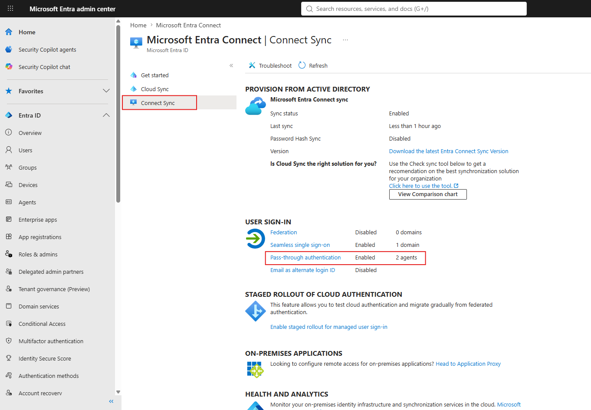
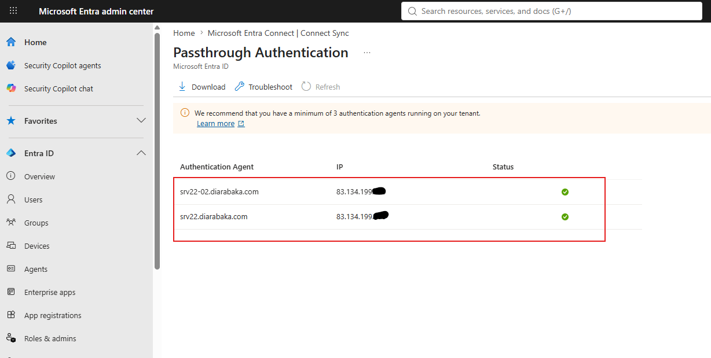
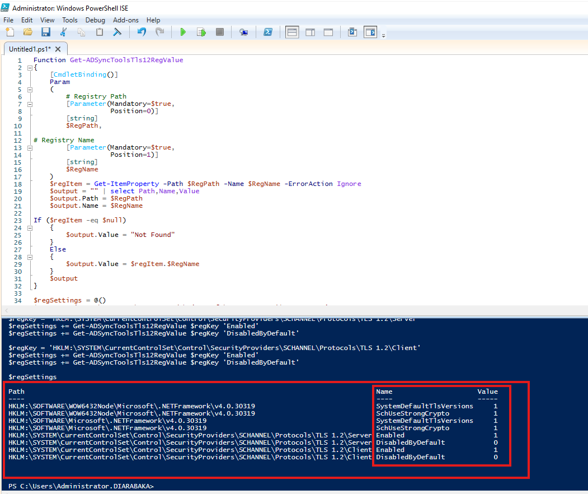

# Microsoft Entra ID Hybrid Identity Lab

Hybrid Identity and Access Management lab integrating on-premises Active Directory with Microsoft Entra ID.


---

## Overview

This lab demonstrates:

- Hybrid identity synchronization
- Secure hybrid authentication
- Microsoft Entra hybrid join
- Conditional Access and MFA
- Passwordless authentication
- RBAC and least privilege
- Microsoft Graph PowerShell automation

---

## Architecture

- **Active Directory Domain Services:** authoritative identity source
- **Entra Connect Sync:** primary synchronization service
- **Entra Cloud Sync:** separate pilot OU without scope overlap
- **Pass-Through Authentication:** primary authentication method
- **Password Hash Synchronization:** resilience option
- **Seamless SSO:** integrated domain authentication
- **Microsoft Entra hybrid join:** domain device registration

---

## Lab Environment

| Component       | Technology                            |
| --------------- | ------------------------------------- |
| Cloud identity  | Microsoft Entra ID                    |
| Directory       | Active Directory Domain Services      |
| Server          | Windows Server 2022                   |
| Client          | Windows 11                            |
| Synchronization | Entra Connect Sync / Cloud Sync pilot |
| Authentication  | PTA / PHS / Seamless SSO              |
| Security        | MFA / FIDO2 / Conditional Access      |
| Automation      | Microsoft Graph PowerShell            |

---

## Identity Management

- User and group administration
- Password reset
- Bulk user provisioning from CSV
- Identity lifecycle automation


---

## Role-Based Access Control

- Administrative role assignments
- Least-privilege access
- Separate privileged accounts
- Delegated administration


---

## Authentication Security

- Microsoft Authenticator
- Temporary Access Pass
- FIDO2 security keys
- Windows Hello for Business
- Authentication strength policies


---

## Conditional Access

- Require MFA
- Protect privileged accounts
- Block legacy authentication
- Protect administrative portals
- Test policies in Report-only mode
- Exclude and monitor emergency access accounts


---

## Device Identity

- Microsoft Entra device registration
- Microsoft Entra hybrid join
- Device identity validation
- Windows LAPS
- Local administrator control


---

## Hybrid Identity

### Microsoft Entra Connect Sync

- Active Directory synchronization
- Organizational Unit filtering
- Pass-Through Authentication
- Password Hash Synchronization
- Seamless Single Sign-On

PTA is the primary method. PHS is enabled as a resilience option; failover requires an administrative change.


### PTA High Availability

- Multiple authentication agents
- Agent redundancy
- Failover testing
- Agent status monitoring





### Synchronization Validation

- Synchronized AD users visible in Entra ID
- On-premises source of authority confirmed
- Expected attributes validated


### Organizational Unit Filtering

- Dedicated synchronization OUs
- Non-required objects excluded
- Synchronization scope validated


### Microsoft Entra Cloud Sync

Cloud Sync was tested on a separate pilot OU without overlap with Entra Connect Sync.


### Microsoft Entra Hybrid Join

- Service Connection Point
- Device registration through Group Policy
- Computer object synchronization
- Primary Refresh Token validation


```text
AzureAdJoined : YES
DomainJoined  : YES
AzureAdPrt    : YES
```


### Seamless Single Sign-On

- Kerberos-based SSO
- Domain workstation authentication
- Integrated Microsoft Entra sign-in


---

## Security Hardening

- TLS 1.2 enforcement
- Least-privilege administration
- Emergency access accounts
- Phishing-resistant authentication for administrators
- Restricted access to synchronization servers
- Sign-in and audit monitoring



---

## Monitoring and Auditing

- Sign-in and failed authentication analysis
- Conditional Access result analysis
- Synchronization and PTA agent monitoring
- Session revocation


---

## PowerShell Automation

- Bulk user provisioning
- User and group management
- Role reporting
- Device inventory
- Security and tenant reporting

```text
scripts/
├── Authentication/
├── Devices/
├── Groups/
├── Roles/
├── Security/
├── Tenant/
└── Users/New-BulkUsers.ps1
```

Scripts use minimum Graph permissions, input validation, error handling, and no plaintext credentials.

---

## Validation Results

| Test                                   | Status |
| -------------------------------------- | :----: |
| User and group synchronization         |  PASS  |
| OU filtering                           |  PASS  |
| PTA authentication and agent failover  |  PASS  |
| Seamless SSO                           |  PASS  |
| Microsoft Entra hybrid join and PRT    |  PASS  |
| MFA enforcement                        |  PASS  |
| Legacy authentication blocked          |  PASS  |
| Cloud Sync pilot without scope overlap |  PASS  |

---

## Skills Demonstrated

- Microsoft Entra ID and Active Directory
- Hybrid Identity, Entra Connect Sync and Cloud Sync
- PTA, PHS and Seamless SSO
- Microsoft Entra hybrid join
- Conditional Access, MFA and FIDO2
- RBAC and Windows LAPS
- Microsoft Graph PowerShell
- Identity monitoring and automation

---

## References

- [Microsoft Entra](https://learn.microsoft.com/en-us/entra/)
- [Hybrid Identity](https://learn.microsoft.com/en-us/entra/identity/hybrid/)
- [Authentication Methods](https://learn.microsoft.com/en-us/entra/identity/hybrid/connect/choose-ad-authn)
- [Conditional Access](https://learn.microsoft.com/en-us/entra/identity/conditional-access/)
- [Microsoft Graph PowerShell](https://learn.microsoft.com/en-us/powershell/microsoftgraph/)
