# Microsoft Entra ID Hybrid Identity Lab

Enterprise Identity and Access Management (IAM) lab demonstrating hybrid identity integration between on-premises Active Directory and Microsoft Entra ID.

---

# Overview

This lab demonstrates the design and implementation of a hybrid identity infrastructure integrating on-premises Active Directory with Microsoft Entra ID.

The environment focuses on identity synchronization, secure authentication, device registration, access control, and administrative automation using Microsoft Graph PowerShell.

---

# Objectives

- Deploy a hybrid identity environment
- Synchronize on-premises identities with Microsoft Entra ID
- Implement secure authentication methods
- Configure Hybrid Microsoft Entra Join
- Apply Conditional Access security policies
- Automate identity administration using PowerShell and Microsoft Graph

---

# Architecture

The environment implements a hybrid identity model where:

- Active Directory acts as the authoritative identity source.
- Microsoft Entra ID provides cloud identity services.
- Identity synchronization is performed using Microsoft Entra Connect Sync and Microsoft Entra Cloud Sync.
- Authentication is secured through MFA and passwordless technologies.

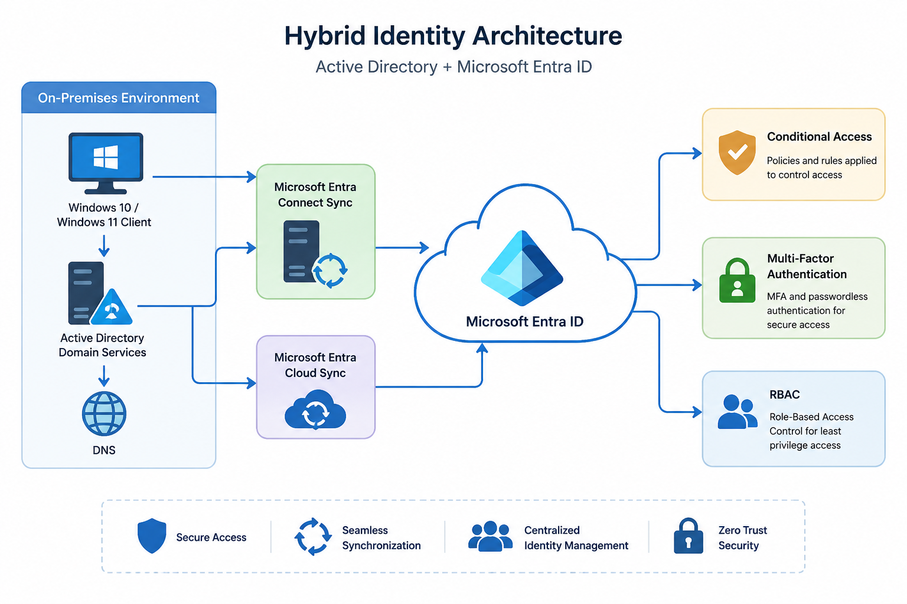

---

# Identity Flow

1. Users and groups are created in Active Directory.
2. Objects are synchronized to Microsoft Entra ID.
3. Authentication policies are applied through Conditional Access.
4. Devices are registered using Hybrid Microsoft Entra Join.
5. Administrators manage identities using Microsoft Graph PowerShell.

---

# Lab Environment

| Component                | Technology                                |
| ------------------------ | ----------------------------------------- |
| Identity Provider        | Microsoft Entra ID                        |
| Directory Service        | Active Directory Domain Services          |
| Server Platform          | Windows Server 2022                       |
| Client Operating Systems | Windows 10 / Windows 11                   |
| Synchronization          | Microsoft Entra Connect Sync / Cloud Sync |
| Automation               | Microsoft Graph PowerShell                |
| Authentication           | MFA / Passwordless / FIDO2                |

---

# Key Features

- Hybrid identity integration
- User and group synchronization
- Password Hash Synchronization
- Seamless Single Sign-On
- Hybrid Microsoft Entra Join
- Conditional Access
- Passwordless authentication
- Device identity management
- Microsoft Graph automation

---

# Identity Management

## User Management

Implemented:

- User creation and administration
- Password management
- Bulk user provisioning using CSV files
- Microsoft Graph PowerShell automation

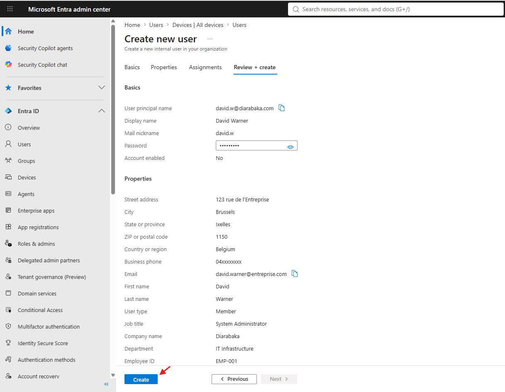

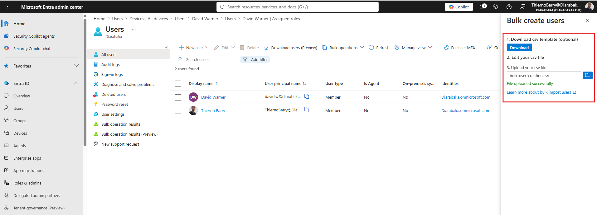

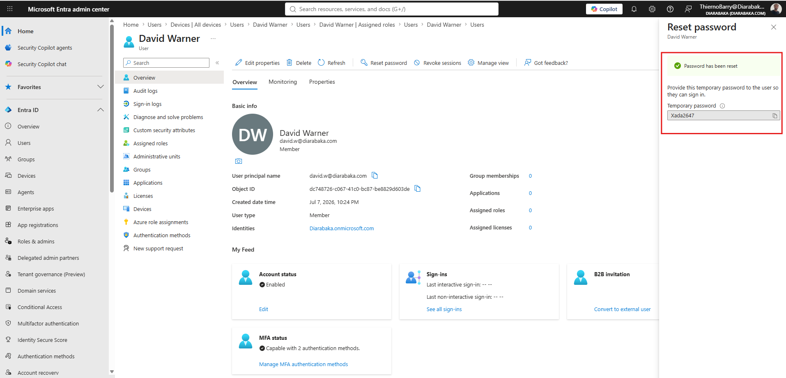

---

# Role-Based Access Control (RBAC)

Implemented:

- Administrative role assignments
- Least privilege administration model
- Delegated administrative access

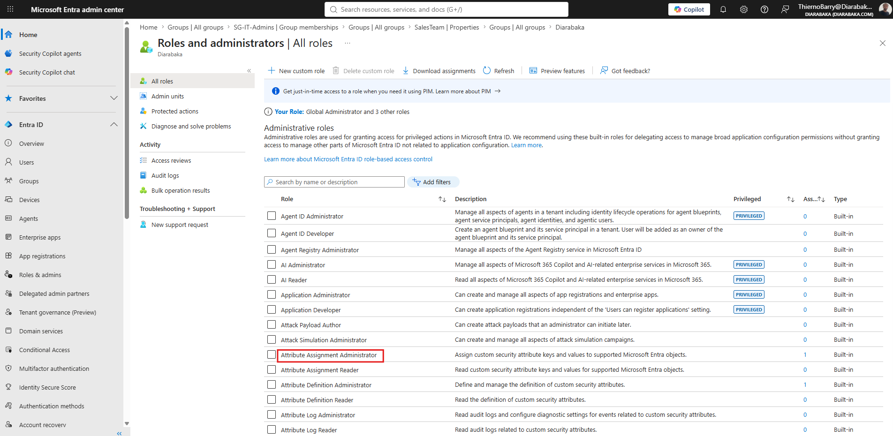

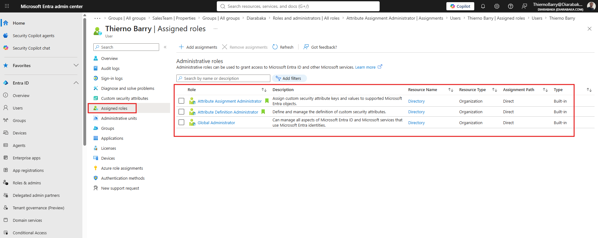

---

# Authentication Security

## Multi-Factor Authentication (MFA)

Configured:

- Microsoft Authenticator
- Phone authentication
- Temporary Access Pass (TAP)
- Authentication method policies

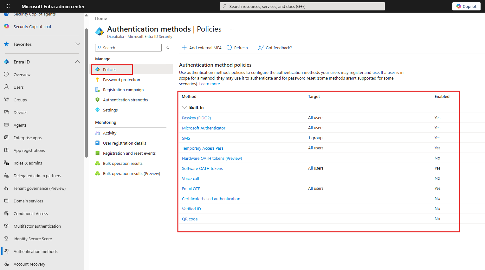

---

## Passwordless Authentication

Configured:

- Passwordless sign-in methods
- FIDO2 security keys
- Authentication strengths and policies

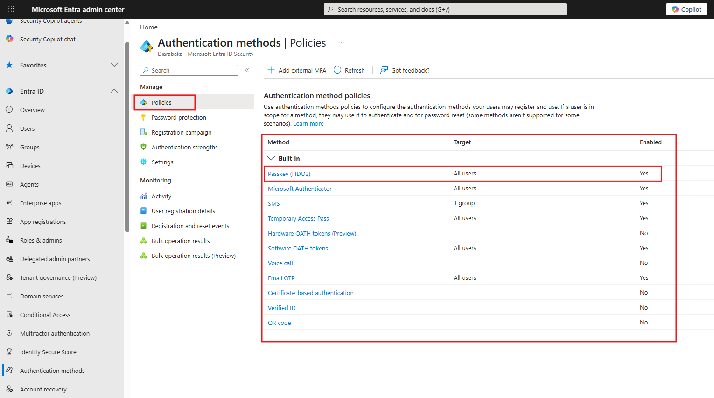

---

# Conditional Access

Implemented security policies including:

- Require MFA for users
- Protect privileged administrative accounts
- Block legacy authentication protocols

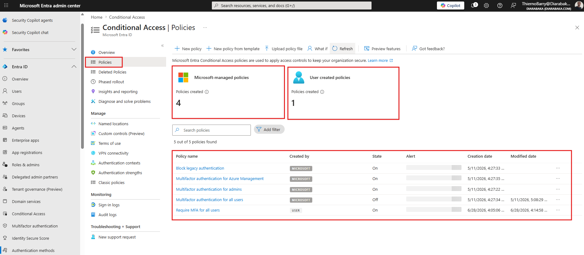

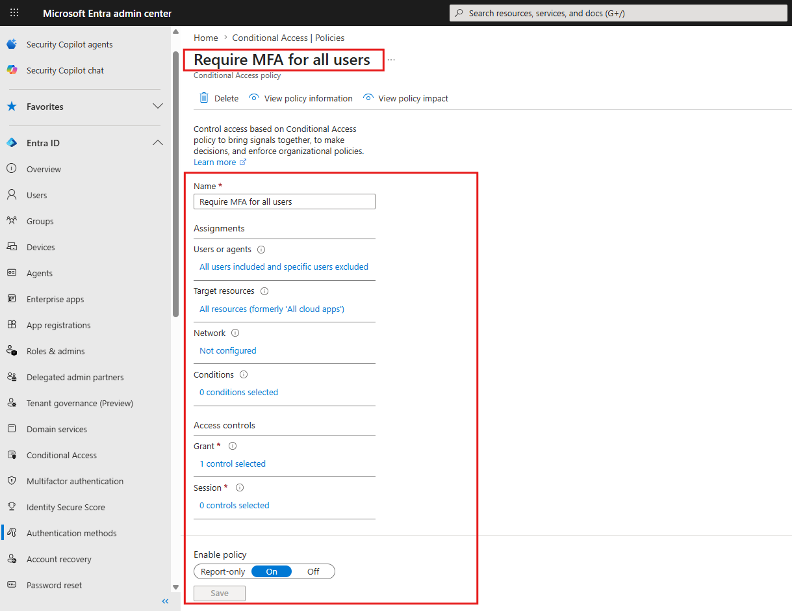

---

# Device Identity

Implemented:

- Microsoft Entra device registration
- Device identity management
- Local administrator management

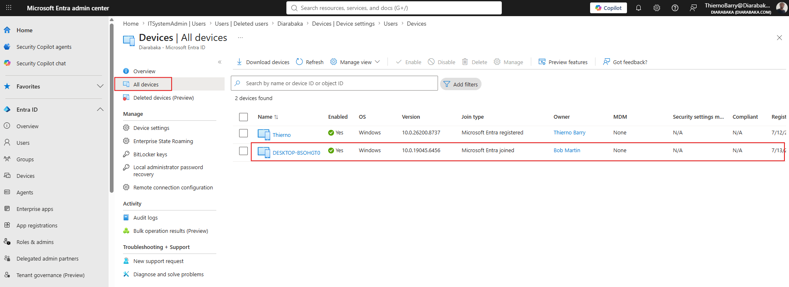

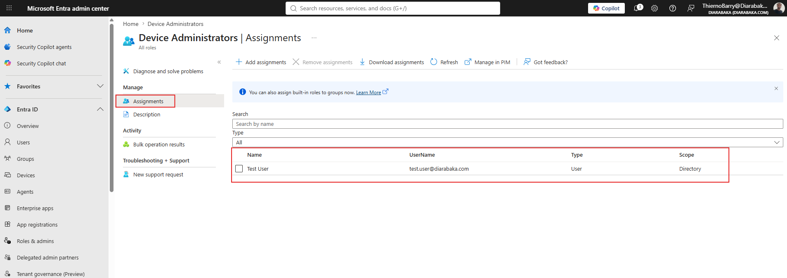

---

# Hybrid Identity Implementation

## Microsoft Entra Connect Sync

Configured:

- Active Directory synchronization
- Password Hash Synchronization (PHS)
- Pass-Through Authentication (PTA)
- Seamless Single Sign-On (SSO)
- Organizational Unit filtering

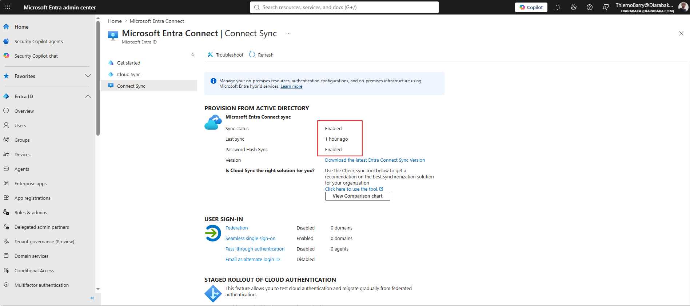

---

## User Synchronization Validation

Validated:

- User objects synchronized from Active Directory
- Source of authority verification
- Hybrid identity confirmation

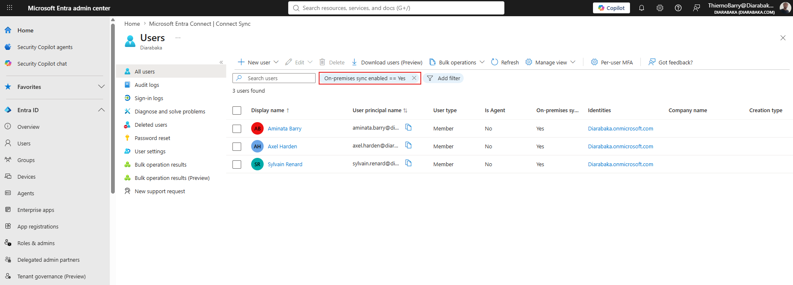

---

## Organizational Unit Filtering

Configured:

- Synchronization scope limitation
- Controlled object synchronization
- OU-based filtering

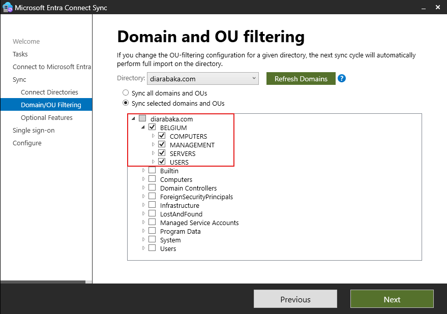

---

## Microsoft Entra Cloud Sync

Configured:

- Cloud Sync Provisioning Agent
- Synchronization configuration
- Provisioning validation and monitoring

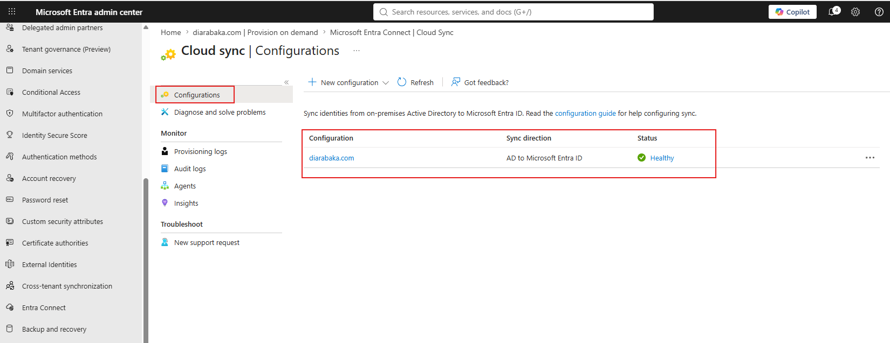

---

## Hybrid Microsoft Entra Join

Configured:

- Hybrid device registration
- Device authentication
- Device synchronization validation

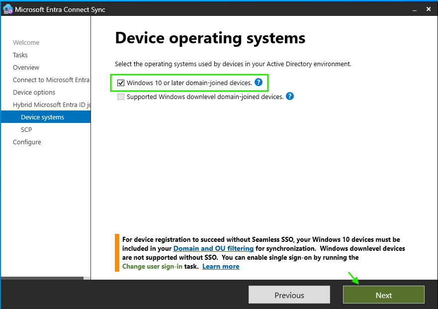

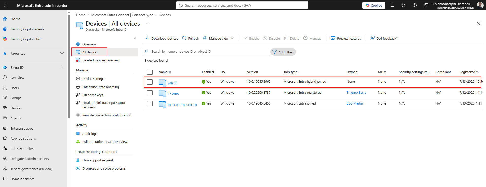

### Validation

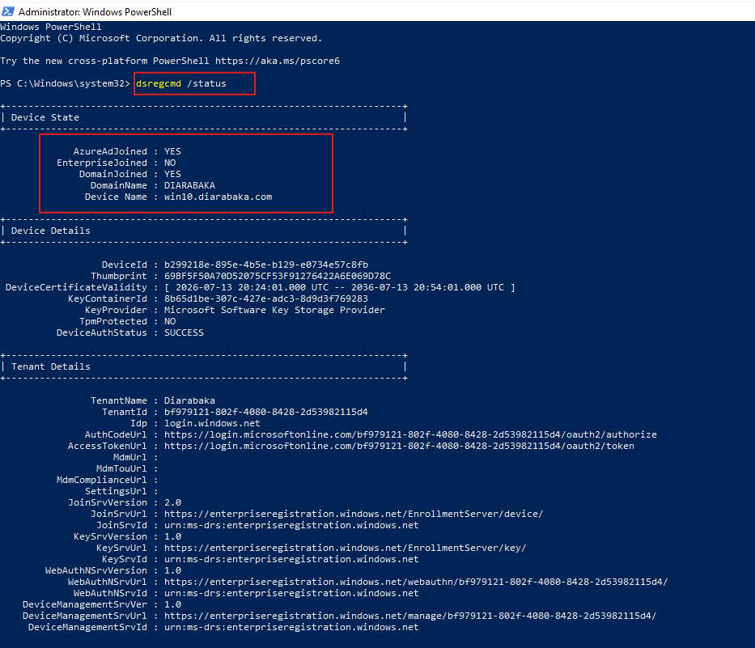

---

## Seamless Single Sign-On

Configured:

- Seamless SSO authentication flow
- Kerberos-based authentication
- Domain authentication validation

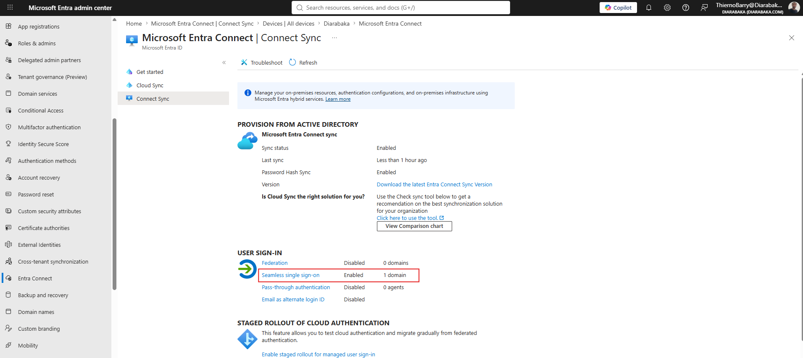

---

# Monitoring and Security Auditing

Implemented:

- Sign-in monitoring
- Authentication log analysis
- Failed login investigations
- Session revocation and user risk analysis

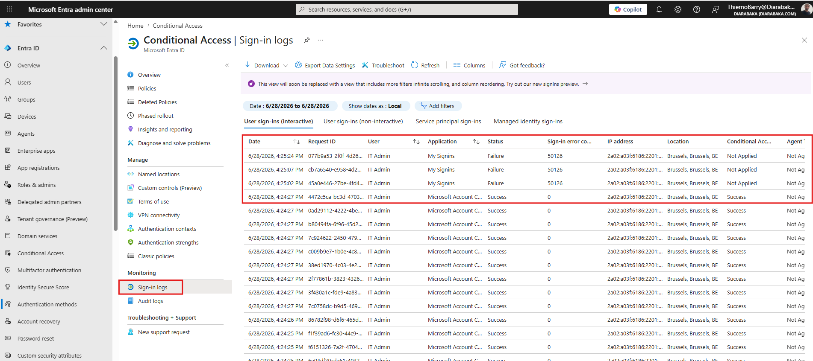

---

# PowerShell Automation

Administrative tasks were automated using Microsoft Graph PowerShell.

Implemented scenarios:

- Bulk user creation
- User lifecycle management
- Identity administration automation
- Microsoft Entra management scripting

Scripts:

- `scripts/Authentication/`
- `scripts/Users/New-BulkUsers.ps1`
- `scripts/Groups/`
- `scripts/Roles/`
- `scripts/Devices/`
- `scripts/Security/`
- `scripts/Tenant/`

---

# Skills Demonstrated

- Microsoft Entra ID
- Active Directory Domain Services
- Hybrid Identity
- Microsoft Entra Connect Sync
- Microsoft Entra Cloud Sync
- Hybrid Microsoft Entra Join
- Conditional Access
- Multi-Factor Authentication (MFA)
- Passwordless Authentication
- FIDO2 Security Keys
- Role-Based Access Control (RBAC)
- Device Identity Management
- Microsoft Graph PowerShell SDK
- Windows Server Administration
- Identity Lifecycle Management
- Identity Automation

---

# References

- https://learn.microsoft.com/en-us/entra/identity/
- https://learn.microsoft.com/en-us/entra/identity/hybrid/
- https://learn.microsoft.com/en-us/powershell/microsoftgraph/
- https://learn.microsoft.com/en-us/entra/identity/devices/
