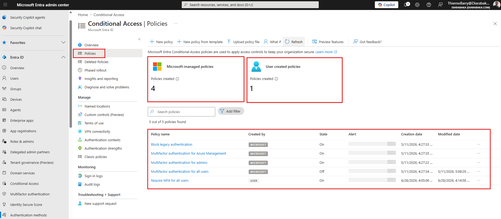
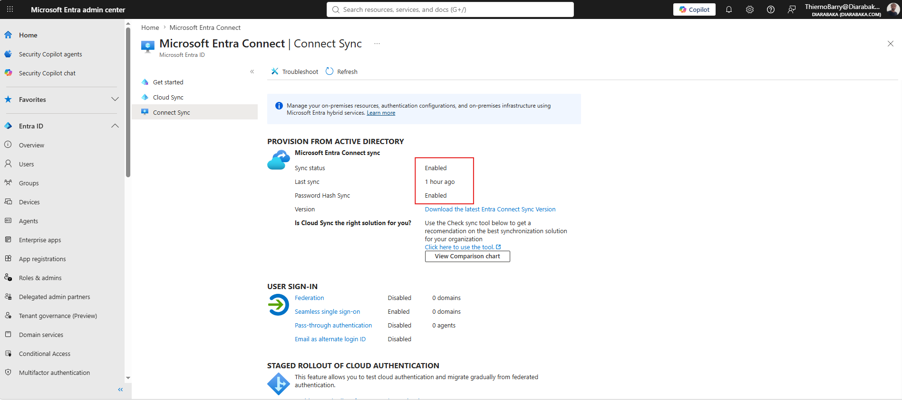
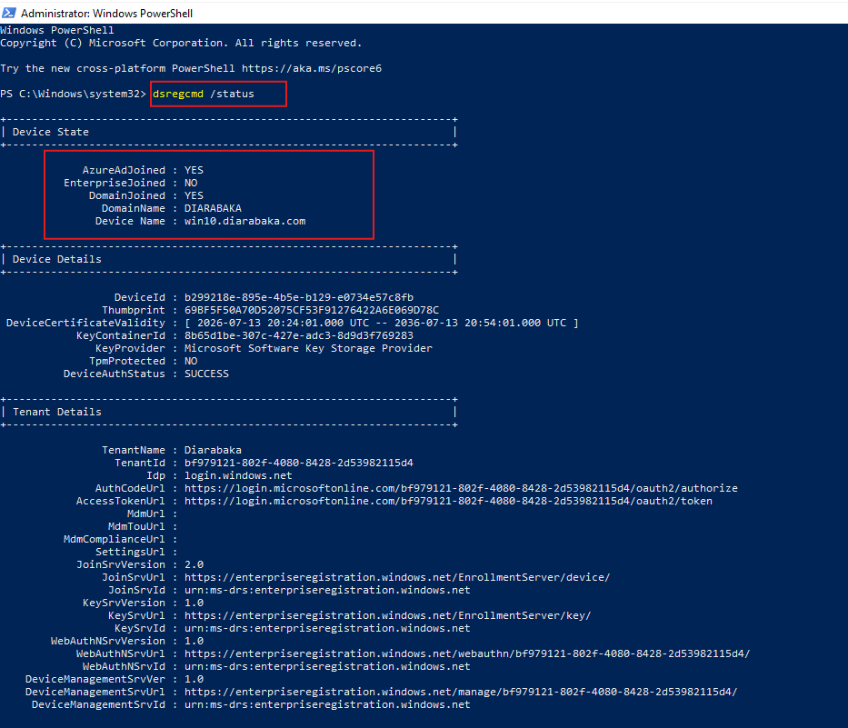

# Microsoft Entra ID - Hybrid Identity Lab


**Objective:** integrate on-premises Active Directory with Microsoft Entra ID and secure identity access.

**Implemented:** hybrid synchronization, authentication, device identity, Conditional Access and identity administration.

## Architecture

- **AD DS:** source of authority for synchronized identities.
- **Entra Connect Sync:** primary synchronization service.
- **Cloud Sync:** separate pilot OU without synchronization scope overlap.
- **PTA:** primary password authentication method, with redundant agents.
- **PHS:** backup authentication option; switching from PTA requires an administrative change.
- **Seamless SSO:** Kerberos-based single sign-on.
- **Platforms:** Windows Server 2022 and Windows 11.

## Identity and Access

- User and group administration, password reset and CSV provisioning.
- Separate privileged accounts, delegated administration and least privilege.
- Microsoft Authenticator, Temporary Access Pass, FIDO2 and Windows Hello for Business.
- Conditional Access for MFA, privileged access and legacy authentication blocking.
- Report-only testing before enforcement.
- Emergency access account exclusions and monitoring.

Synchronized identities are managed in AD; cloud-only identities are managed in Entra ID.



More screenshots:

[Users](./assets/users/create-user.png)

[Bulk provisioning](./assets/users/bulk-users-upload.png)

[Password reset](./assets/users/reset-password.png)

[Roles](./assets/rbac/directory-roles-overview.png)

[Role assignment](./assets/rbac/user-role-assignment.png)

[Authentication methods](./assets/security/authentication-methods.png)

[Passwordless](./assets/security/passwordless.png)

[MFA policy](./assets/security/require-mfa-policy.png).

## Hybrid Identity and Devices

- OU filtering and user/group synchronization.
- Cloud Sync pilot isolated from Connect Sync scope.
- PTA authentication and agent redundancy testing.
- PHS enabled as a resilience option.
- Hybrid join, PRT validation, Windows LAPS and local administrator control.

**PTA agent failover and the manual switch to PHS are separate operations.**



Hybrid join validation checks:

```text
AzureAdJoined : YES
DomainJoined  : YES
AzureAdPrt    : YES
```



More screenshots:

[OU filtering](./assets/hybrid/ou-filtering.png)

[Synchronized user](./assets/hybrid/synced-user.png)

[Cloud Sync](./assets/hybrid/cloud-sync.png)

[PTA agents](./assets/hybrid/pta-agents.png)

[Agent details](./assets/hybrid/pta-agents_details.png)

[SSO](./assets/hybrid/sso.png)

[Hybrid join](./assets/hybrid/hybrid-join.png)

[Device registration](./assets/hybrid/hybrid-device-registration.png)

[Devices](./assets/devices/entra-device.png)

[Local administration](./assets/devices/local-admin.png).

## PowerShell Automation

Microsoft Graph PowerShell is used for provisioning, inventory and identity reporting.

```text
scripts/
├── Common/Connect-Graph.ps1
├── Authentication/Get-MFAStatus.ps1
├── Devices/Get-HybridJoinedDevices.ps1
├── Groups/Get-GroupMembers.ps1
├── Roles/Get-RoleAssignments.ps1
├── Security/
│   ├── Get-SignInLogs.ps1
│   └── Get-ConditionalAccessPolicies.ps1
├── Tenant/Get-TenantInformation.ps1
└── Users/
    ├── New-BulkUsers.ps1
    ├── Get-EntraUsers.ps1
    └── Disable-User.ps1
```

## Validation Results

| Test                                   | Result |
| -------------------------------------- | :----: |
| User and group synchronization         |  PASS  |
| OU filtering                           |  PASS  |
| PTA authentication and agent failover  |  PASS  |
| Seamless SSO                           |  PASS  |
| Hybrid join and PRT                    |  PASS  |
| MFA enforcement                        |  PASS  |
| Legacy authentication blocking         |  PASS  |
| Cloud Sync pilot without scope overlap |  PASS  |

## Operations

- **Synchronization:** inspect errors and scope, correct the cause and verify affected objects.
- **PTA outage:** check agents, connectivity and AD availability; restore service and retest authentication.
- **PHS recovery:** confirm readiness before a controlled manual authentication-method switch.
- **Conditional Access lockout:** use emergency access, inspect the policy and retest after correction.
- **Device issues:** inspect dsregcmd, registration logs and device synchronization.

Monitoring references:

[Sign-in logs](./assets/security/signin-logs.png)

[TLS configuration](./assets/security/tls12.png).

## Documentation

- https://learn.microsoft.com/powershell/microsoftgraph/authentication-commands
- https://learn.microsoft.com/graph/api/authenticationmethodsroot-list-userregistrationdetails
- https://learn.microsoft.com/graph/api/signin-list
- https://learn.microsoft.com/graph/api/user-post-users
- https://learn.microsoft.com/graph/api/user-update
- https://learn.microsoft.com/graph/api/user-revokesigninsessions
- https://learn.microsoft.com/graph/permissions-reference

## References

- [Microsoft Entra ID](https://learn.microsoft.com/en-us/entra/)
- [Hybrid Identity](https://learn.microsoft.com/en-us/entra/identity/hybrid/)
- [Hybrid Authentication](https://learn.microsoft.com/en-us/entra/identity/hybrid/connect/choose-ad-authn)
- [Conditional Access](https://learn.microsoft.com/en-us/entra/identity/conditional-access/)
- [Microsoft Graph PowerShell](https://learn.microsoft.com/en-us/powershell/microsoftgraph/)
